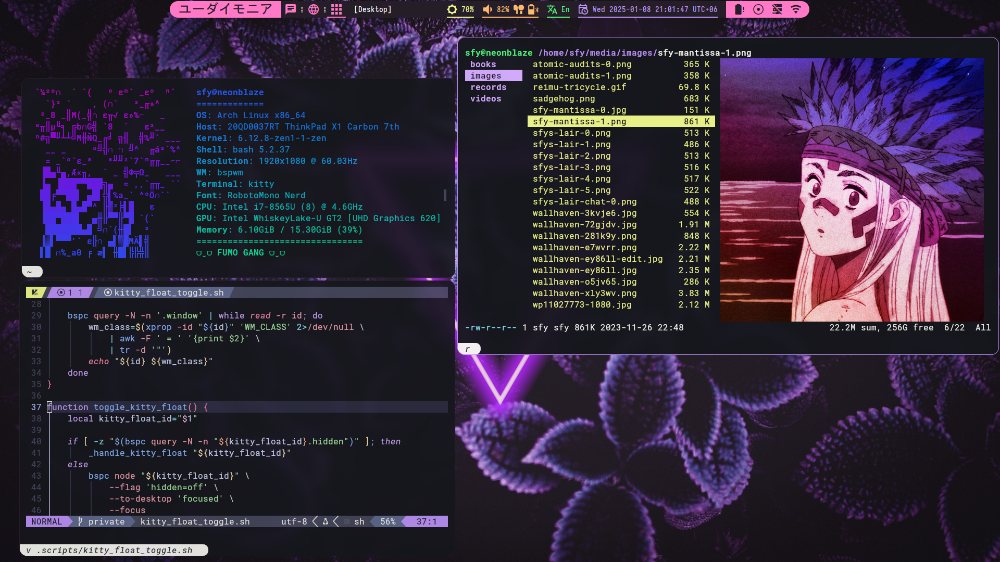

# ⭐ Dotfiles

## Description

My dotfiles. See `Notes` for quirks.

## Installlation

Automation is done using `stow`. See provided `makefile` for details.

In project directory:

- `make` (re-)deploys the symlinks for files to `$HOME`
- `make remove` removes the symlinks created by `make`

> Note: if there are any conflicts e.g. the deployment of symlinks would
> overwrite files, which already exist, `stow` WILL fail. Resolve the
> conflicts manually if needed.

## Notes

### NeoVim

1. Inherits `.vimrc` configuration in `nvim/init.lua`.
2. Overrides certain parts from `.vimrc` in `nvim/lua/vimrc-override.lua`.

### Polybar

Has a bunch of custom scripts in `polybar/scripts`, which are then used in
`polybar/config.ini`:

1. `polybar/scripts/datetime.sh`: default module lacks the needed formatting.
2. `polybar/scripts/layout.sh`: default module lacks the needed formatting.
3. `polybar/scripts/openvpn.sh`: `openvpn` status.
4. `polyber/scripts/pulseaudio-control-wrapper.sh`: control wrapper for a
   customized fork of `pulseaudio-control` (+battery level for earphones).
5. `polybar/scripts/window.sh`: my custom replacement for
   [MateoNitro550/xxxwindowPolybarModule](https://github.com/MateoNitro550/xxxwindowPolybarModule).

### Xinitrc

Has a block, which handles (re-)attaching external keyboards smoothly, a
slight rewrite of a solution found here:
[How to set the keymap for keyboards that are plugged in later?](https://unix.stackexchange.com/questions/253489/how-to-set-the-keymap-for-keyboards-that-are-plugged-in-later)
